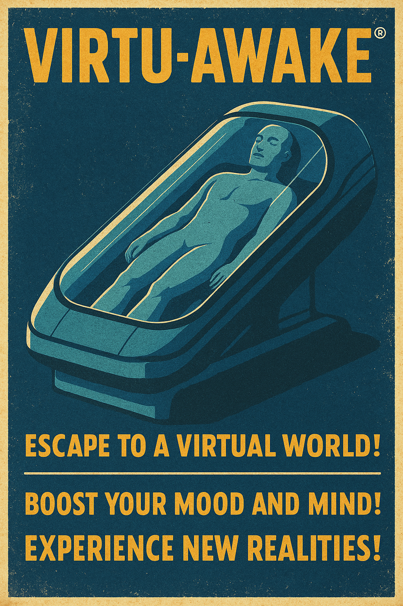

# Virtu-Awake

Immersive VR pods, psychological storytelling, and quiet simulation horror for RimWorld.

Virtu-Awake adds virtual-reality pods that deliver recreation, skill training, social scenes, lucid dreamscapes, and long-form VR immersion. Pawns gain trait-aware memories, build **Lucidity**, risk **Instability**, and may glitch, awaken – or break out.

---

## Core Features

### VR Pods & Sessions
- Build VR pods under **Recreation / Misc**; use them for:
  - Recreation and joy
  - Skill-targeted training (SimTypes: Combat, Nature, Medicine, Social, Intellectual, etc.)
  - Social VR sessions (paired pods for shared dreams and scenes)
  - Long-form sessions that sustain rest, food, and comfort during deep immersion
- Joy-giver based usage: VR is a recreation activity, not “work”
- Float-menu controls to:
  - Start immersive sessions
  - Initiate social VR
  - Stabilise unstable simulations (researchers can calm the system)

### Lucidity & Instability

**Lucidity (Need)**  
- A special need that only exists while in VR  
- Rises during simulations, decays and removes itself outside VR  
- Trait-based multipliers (e.g., TooSmart/Sanguine gain Lucidity faster; Neurotic/Depressive slower)

**Instability (Hediff)**  
- A staged hediff that only appears in VR  
- Stages like *Calm Flicker*, *Pattern Seen*, *Deep Fracture*, *Collapse Warning*  
- Affects mood, stats, and perception; self-removes on exit  
- Driven by pod tick logic with:
  - Trait multipliers
  - Long-session multipliers
  - Research-based stabilisation

### Awakening Tiers & Psychological States
- Lucidity + Instability feed into **Awakening tiers**:
  - *Compliant* → *Flicker* → *Dissociation* → *Realisation* → *Breakthrough*
- Each tier has its own **awakening thoughts** with mood impact
- High-tier states can trigger:
  - Panic/derealisation mental states
  - Trait-aware VR “epiphany” or breakdowns
- Awakening is rare but powerful: pawns may never see the deepest tiers… or they might see them too often.

---

## VR Events & Glitches

### Event Engine
- A dedicated map component watches all active pods and rolls **VR anomalies**:
  - Minor, Moderate, Major, Crisis severities
  - Weighted by Lucidity, Instability, traits, and current mood
- Events are defined via `MatrixEventDef` and resolved through a central utility:
  - Apply Lucidity/Instability adjustments
  - Grant event-specific memories
  - Trigger side-effects (e.g., mood, social, mental states)

### Glitches
- Tiered glitch memories (positive, neutral, negative, major)
- Trigger chance scales with:
  - Lucidity
  - Instability
  - Trait configuration (psy-sensitive, neurotic, ascetic, etc.)
- Glitch texts are first-person, trait-aware, and can fire:
  - Periodically during long sessions
  - More frequently at higher Lucidity/Instability
- Visual & narrative support for:
  - Soft flickers
  - Patterned déjà vu
  - Reality fractures
  - Catastrophic anomaly hooks (multi-pod Crisis events – partially implemented, more in roadmap)

### Shared Dream Network
- Experimental event chain for **linked dream sessions**:
  - Multi-pod sync anomalies
  - Shared memories and emotional bleed between sleepers
  - Wake / eject coordination
- Trait-aware outcome branches and deeper narrative overlays are scaffolded and being expanded.

---

## Memories & Trait Overlays

### Skill-Tier VR Memories
- Each SimType/skill tier generates:
  - Base VR memory lines (e.g., “VR training sim: fluent marksmanship”)
  - Tiered mood boosts based on experience intensity
- VR memories can trigger:
  - On session milestones
  - Periodically during extended sessions (no need to exit the pod)

### Trait-Specific & Combo Memories
- Every relevant trait has overlays that **append** flavour onto base VR memories:
  - Single-trait overlays
  - Dual-trait “legendary” overlays
  - Triple-trait “mythic” overlays
- Overlays:
  - Are appended after the core description (never overwrite it)
  - Are capped at **three overlays per memory** to keep things readable
  - Prefer dual/triple combos when a pawn’s trait set matches
- Anti-spam safeguards:
  - No back-to-back VR memories for the same skill while an older one is active
  - In-pod memories trickle in over time, not every tick

---

## Breakouts & Simulation Horror

### Breakout Conditions
- When Lucidity and Instability spike high enough:
  - The pawn may **realise** the simulation is wrong
  - Special checks run for:
    - Colonists
    - Prisoners
    - Slaves

### Breakout Behaviours
- Uses trait-aware mental break flows:
  - Panic flee / sad wander / derealisation
  - Sabotage (fire-starting, equipment damage)
  - Berserk or violent confrontations
  - Prison / slave breaks initiated out of VR
- Pods forcibly eject the pawn on breakout; external mental states then play out in the real colony.

---

## Power, Vitals & Isolation

- VR pods act as **active power sources** when occupied:
  - Generate a small amount of power during sessions
  - No idle draw when empty
- Sessions sustain basic vitals:
  - Rest, food, and comfort are lightly supported while immersed
- Environmental and social shielding:
  - Pawns in VR are insulated from most outside interactions
  - Weather and many external threats are softened or ignored
  - Good synergy with nudist/undergrounder vibes and certain ideologies

---

## Installation & Load Order

1. Subscribe to / install **Harmony** (required).
2. Place Virtu-Awake in your `Mods/` folder or install via Workshop.
3. Recommended load order:
   1. Harmony  
   2. Core + DLC (Royalty / Ideology / Biotech)  
   3. **Virtu-Awake**  
   4. Other gameplay/content mods  
   5. Compatibility patches  

VR pods should appear under:
- **Architect → Recreation / Misc**, and  
- Usable by colonists and (where allowed) prisoners/slaves.

---

## How to Play

1. **Build a VR Pod**  
   - Ensure it has power and is reachable.

2. **Let Pawns Use It for Joy / Training**  
   - Schedule free time or recreation
   - Right-click for forced sessions or social VR

3. **Watch Lucidity & Instability**  
   - Inspect the pod gizmo and pawn inspect string while in VR
   - High Lucidity with rising Instability = weirder events and riskier awakenings

4. **Read the Memories**  
   - Open Needs → Mood
   - Look for VR-tagged memories:
     - Skill-tier training experiences
     - Trait-flavoured overlays
     - Glitch, awakening, and event memories

5. **Stabilise or Push the Edge**  
   - Use the stabilisation job to calm unstable sims  
   - Or… let things escalate and see what breaks.

For structured testing, see **PLAYTEST.md** in the repository.

---

## Current Status

Virtu-Awake is currently in an **alpha** state:

- ✅ Core VR pod gameplay loop (recreation, skill training, social sessions)  
- ✅ Lucidity & Instability systems with awakening tiers and mental states  
- ✅ VR event engine with minor–major anomalies and shared-dream scaffolding  
- ✅ Extensive VR memory and trait overlay library (single/dual/triple)  
- ✅ Breakout checks and trait-aware break behaviours  
- ✅ Build/check scripts and basic QA scenarios  

Planned / in-progress highlights:

- Catastrophic multi-pod Crisis events
- Deeper Shared Dream Network outcomes (letters, trait-aware branches)
- RimWorld-style VR pod sprites and glitch VFX
- Release automation and Workshop-ready description/artwork

See `TASKS.md` for a live breakdown of systems, their DONE/TODO status, and agent-friendly work items.

---

## Contributing

Contributions are welcome! You can:

- Improve balance (joy rates, XP gains, Lucidity/Instability curves)
- Add new SimTypes and memory lines
- Extend Matrix events with more trait-aware outcomes
- Provide art: RimWorld-style sprites, glitch overlays, banner variants
- Help with localisation of Keyed strings

See:

- `CONTRIBUTING.md` – workflow, coding style, and pull request guidelines  
- `STYLE_GUIDE.md` – C# / XML / narrative style rules  
- `TASKS.md` – current task board for AI and human contributors  

---

## License

Virtu-Awake is released under the **MIT License**.  
You are free to fork, extend, integrate, and remix, as long as you keep the license notice.

---

> *“Some pawns go to the pods for rest. Some go for answers. A few come back with questions none of us were ready to hear.”*
